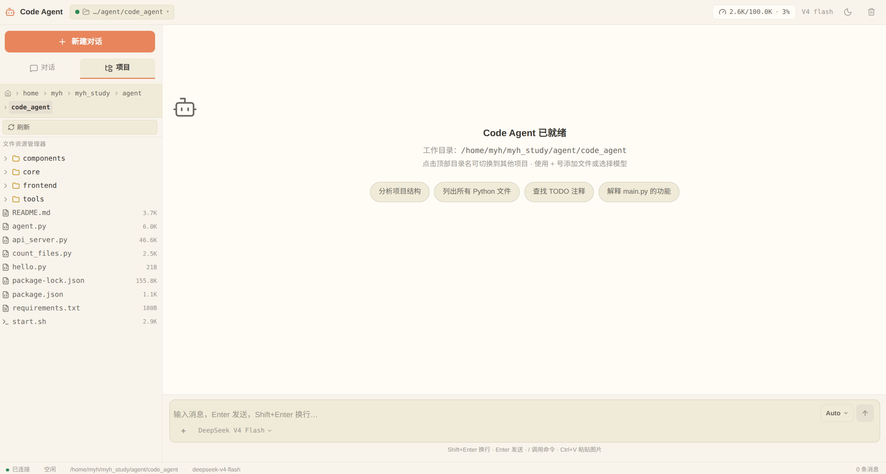

<p align="center">
  
  
  
  
</p>

<br>

<div align="center">
<pre>
╔══════════════════════════════════════════════════════════════╗
║                                                              ║
║         ██████╗  ██████╗ ██████╗ ███████╗                    ║
║        ██╔════╝ ██╔═══██╗██╔══██╗██╔════╝                    ║
║        ██║      ██║   ██║██║  ██║█████╗                      ║
║        ██║      ██║   ██║██║  ██║██╔══╝                      ║
║        ╚██████╗ ╚██████╔╝██████╔╝███████╗                    ║
║         ╚═════╝  ╚═════╝ ╚═════╝ ╚══════╝                    ║
║                                                              ║
║         █████╗  ██████╗ ███████╗███╗  ██╗████████╗           ║
║        ██╔══██╗██╔════╝ ██╔════╝████╗ ██║╚══██╔══╝           ║
║        ███████║██║  ██╗ █████╗  ██╔██╗██║   ██║              ║
║        ██╔══██║██║  ╚██╗██╔══╝  ██║╚████║   ██║              ║
║        ██║  ██║╚██████╔╝███████╗██║ ╚███║   ██║              ║
║        ╚═╝  ╚═╝ ╚═════╝ ╚══════╝╚═╝  ╚══╝   ╚═╝              ║
║                                                              ║
║          ClaudeCode 风格智能体工作台 · 一站式 AI 编程助手       ║
╚══════════════════════════════════════════════════════════════╝
</pre>
</div>

<br>

<p align="center">
  <b>多轮对话 · 工具调用 · 任务编排 · 文件快照 · 实时协作</b>
</p>



# Code Agent

> ClaudeCode 风格的智能体工作台 —— 多轮对话、工具调用、任务编排，一站式 AI 编程助手。

## ✨ 核心功能

| 功能 | 说明 |
|-----|------|
| 多轮对话 | 基于 SocketIO 的流式响应，可中途终止 |
| 工具调用展示 | 每次工具调用以卡片形式展示输入、输出和耗时 |
| 文件树 | 左侧展示工作目录结构，点击查看文件内容 |
| 文件编辑 | 编辑器支持修改代码，保存时自动备份原文件 |
| 任务看板 | 三列展示任务状态，Agent 执行时实时更新 |
| Todo 列表 | 同步 Agent 内部 Todo，前端即时刷新 |
| 多 Agent 状态 | 显示子 Agent 的运行状态和角色信息 |
| 安全快照 | 手动创建和恢复文件快照 |
| 工作目录切换 | 切换 Agent 当前操作的工作目录 |
| 状态栏 | 底部显示连接状态、Agent 状态和当前模型 |

## 🚀 快速开始

### 环境要求

- **Python** 3.10+（推荐 conda 环境）
- **Node.js** 18+
- **Anthropic API Key**（[获取 Token](https://console.anthropic.com/)）

### 1. 安装依赖

```bash
# 后端
conda activate code_agent          # 或使用 venv
pip install -r requirements.txt

# 前端
cd frontend && npm install
```

### 2. 配置环境变量

```bash
cp .env.example .env   # 如有示例文件
```

编辑 `.env`：

```env
ANTHROPIC_AUTH_TOKEN=sk-ant-...
MODEL_ID=claude-sonnet-4-20250514
# 可选：自定义 API 代理
# ANTHROPIC_BASE_URL=https://your-proxy.com
```

### 3. 启动服务

```bash
./start.sh
```

访问 <http://localhost:5173> 即可使用。

<details>
<summary>手动启动（双终端）</summary>

```bash
# 终端 1：后端 API
conda activate code_agent && python api_server.py

# 终端 2：前端开发服务器
cd frontend && npm run dev
```

</details>

## 📁 项目结构

```
code_agent/
├── api_server.py              # Flask + SocketIO 后端入口
├── agent.py                   # CLI 模式入口
├── start.sh                   # 一键启动脚本
├── requirements.txt           # Python 依赖
├── core/
│   ├── loop.py                # Agent 主循环（含事件回调钩子）
│   └── subagent.py            # 子 Agent 执行器
├── components/
│   ├── config.py              # 配置管理
│   ├── compactor.py           # 上下文压缩
│   ├── memory_manager.py      # 记忆管理
│   ├── safety_manager.py      # 安全快照
│   ├── todo_manager.py        # Todo 管理
│   ├── task_manager.py        # 任务管理
│   ├── team_manager.py        # 多 Agent 协作
│   ├── message_bus.py         # 消息总线
│   ├── background_manager.py  # 后台任务管理
│   ├── error_recovery.py      # 错误恢复
│   └── skill_loader.py        # Skill 加载器
├── tools/
│   ├── base.py                # 工具基类与注册
│   ├── memory.py              # 记忆工具
│   ├── safety.py              # 安全工具
│   ├── background.py          # 后台执行工具
│   ├── task_board.py          # 任务看板工具
│   ├── todo.py                # Todo 工具
│   ├── team.py                # 团队工具
│   ├── skill.py               # Skill 工具
│   ├── compress.py            # 压缩工具
│   ├── protocols.py           # 协议工具
│   └── worktree.py            # Worktree 工具
├── frontend/
│   └── src/
│       ├── App.tsx            # 主应用骨架（三栏布局）
│       ├── hooks/             # SocketIO / 聊天状态 Hooks
│       ├── components/        # 聊天气泡、工具时间线、面板组件
│       ├── lib/               # API 客户端、类型定义、工具函数
│       └── assets/            # 静态资源
└── .env                       # 环境变量（已 Git 忽略）
```

## 🔌 API 参考

### RESTful 接口

| 方法 | 路径 | 说明 |
|------|------|------|
| `GET` | `/api/status` | Agent 运行状态 |
| `POST` | `/api/chat` | 发送消息（异步，SocketIO 推送响应） |
| `POST` | `/api/chat/interrupt` | 中断当前执行 |
| `GET` | `/api/history` | 获取对话历史 |
| `DELETE` | `/api/history` | 清空对话历史 |
| `GET` | `/api/tasks` | 获取任务列表 |
| `POST` | `/api/tasks` | 创建新任务 |
| `GET` | `/api/todos` | 获取 Todo 列表 |
| `GET` | `/api/team` | 获取团队成员状态 |
| `GET` | `/api/memory/stats` | 记忆统计信息 |
| `POST` | `/api/memory/search` | 搜索记忆内容 |
| `GET` | `/api/safety/checkpoints` | 快照列表 |
| `POST` | `/api/safety/checkpoint` | 创建文件快照 |
| `POST` | `/api/safety/restore` | 恢复文件快照 |
| `GET` | `/api/files/tree` | 获取文件树 |
| `GET` | `/api/files/content` | 获取文件内容 |

### SocketIO 事件

| 事件 | 方向 | 说明 |
|------|------|------|
| `agent_event` | Server → Client | 所有 Agent 结构化事件推送 |
| `send_message` | Client → Server | 发送对话消息 |
| `interrupt` | Client → Server | 中断 Agent 执行 |

**`agent_event` 类型：** `run_start` · `run_end` · `chunk` · `tool_start` · `tool_result` · `agent_state` · `interrupted` · `error`

## 🛠️ 技术栈

| 层级 | 技术 |
|------|------|
| AI 模型 | Anthropic Claude API |
| 后端框架 | Flask + Flask-SocketIO |
| 实时通信 | Socket.IO (WebSocket) |
| 前端框架 | React 18 + TypeScript |
| 构建工具 | Vite |
| 状态管理 | React Hooks + SocketIO 事件驱动 |

## 🗺️ 后续优化方向

- [ ] **Agent 循环稳定性** — 长对话下工具调用超时重试、流式中断后的状态一致性恢复
- [ ] **上下文压缩策略** — 按 token 预算智能裁剪历史，保留关键决策节点而非简单截断
- [ ] **前端渲染性能** — 长消息列表虚拟滚动、工具卡片懒加载、SocketIO 事件节流
- [ ] **错误恢复增强** — 分级降级策略（重试→回退→提示用户），减少对话中断
- [ ] **文件编辑 Diff 预览** — Agent 修改文件前展示 diff，支持逐块接受/拒绝
- [ ] **记忆检索优化** — 向量化存储 + 语义搜索，长生命周期项目中精准召回上下文
- [ ] **多工作目录并行** — 侧栏多项目标签页，Agent 跨项目引用代码
- [ ] **测试自愈** — Agent 发现测试失败后自动分析根因并提议修复

## 📄 License

MIT © [myh-1302](https://github.com/myh-1302)
